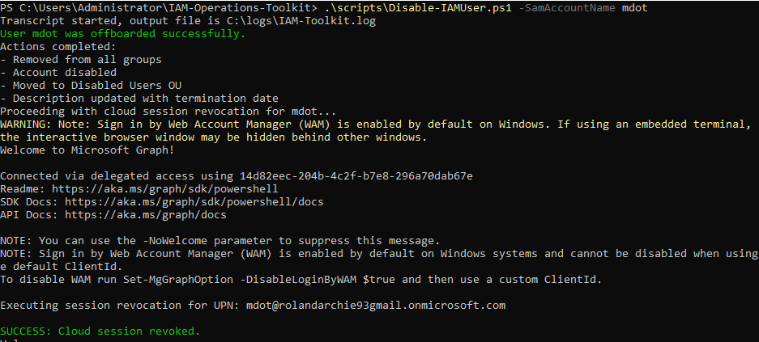

# IAM Operations Toolkit

*A professional-grade PowerShell toolkit for automating and securing hybrid identity lifecycle management across Active Directory and Microsoft Entra ID.*

---

## 🎯 Project Mission

This toolkit simulates real-world Identity and Access Management (IAM) operations in a hybrid enterprise environment.

It focuses on automating secure user lifecycle processes while enforcing best practices aligned with:
- Microsoft SC-300 (Identity and Access Administrator)
- Microsoft AZ-500 (Azure Security Engineer)

---

## ✨ Key Features

### 🔐 Hybrid User Termination ("Cloud Kill Shot")
Securely offboards users by:
- Disabling the on-prem Active Directory account  
- Removing all group memberships (RBAC cleanup)  
- Moving the account to a Disabled Users OU  
- Updating audit metadata  
- **Revoking all active cloud sessions via Microsoft Graph**

### 🔐 Secure User Provisioning
- Uses `[SecureString]` for password handling  
- Prevents plaintext credential exposure  
- Aligns with enterprise security standards  

### 📊 Auditing & Compliance
- Group membership auditing  
- Logging of all actions via transcript files  
- Foundation for future security posture checks  

### 🛠️ Reliability & Engineering Practices
- Try/Catch error handling  
- Defensive scripting (safe disconnects, transcript handling)  
- Full audit logging for traceability  

---

## 🧠 Architecture Overview

`Active Directory → PowerShell Automation → Microsoft Graph → Entra ID`

This ensures **complete identity termination across on-prem and cloud environments.**

---

## 🔧 Key Feature Deep Dive: "Cloud Kill Shot"

To eliminate the risk of lingering cloud access after termination, the script revokes all active sessions using Microsoft Graph.

### Core Logic

```powershell
Connect-MgGraph -Scopes "User.ReadWrite.All", "AuditLog.Read.All"

$upn = "$SamAccountName@rolandarchie93gmail.onmicrosoft.com"

Revoke-MgUserSignInSession -UserId $upn -ErrorAction Stop

---

## 📸 Proof of Execution

### ✅ Successful Offboarding + Session Revocation


